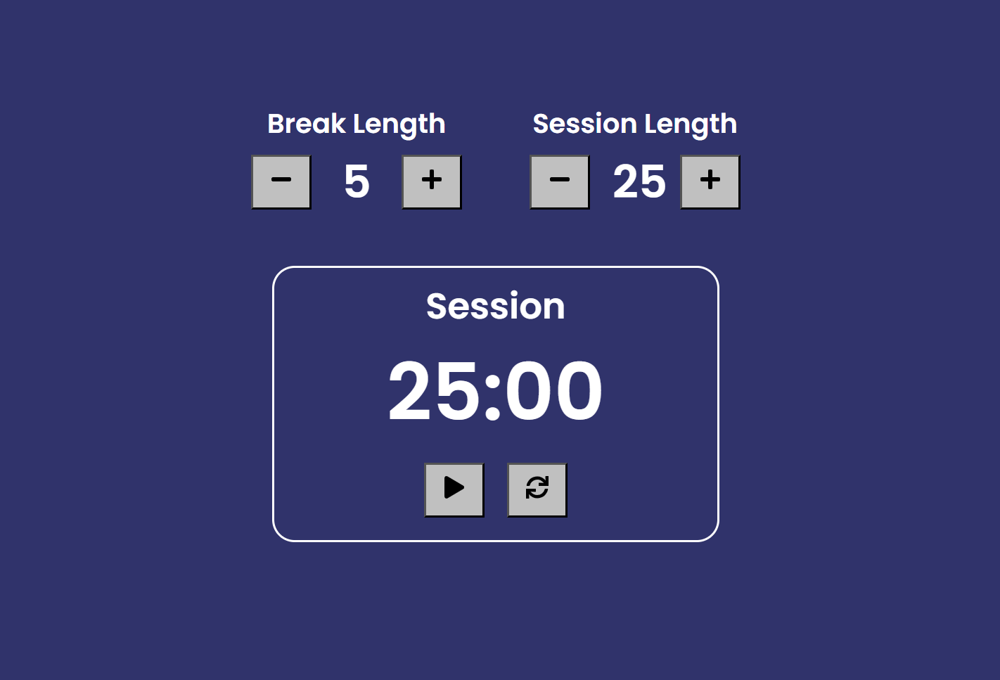

# build-react-clock🔁

## Description 📜
The React Pomodoro Timer is a web-based application designed to help users manage their time efficiently by following the Pomodoro Technique. This technique divides work into intervals (typically 25 minutes of work followed by a 5-minute break), making it easier to focus and maintain productivity.
This project aims to replicate the functionality of the 25 + 5 Clock provided by freeCodeCamp. The application is built using modern web technologies, primarily React, and includes all the necessary user stories and features to meet the project requirements.

## Features 🎉

- Break and Session Length Adjustment: Users can set custom lengths for their work sessions and breaks.
- Timer Display: The countdown is displayed in a mm:ss format and updates every second.
- Start/Stop Functionality: Users can start or pause the timer at any moment.
- Automatic Switching: The timer automatically switches between work sessions and breaks.
- Reset Functionality: Users can reset the timer to default settings at any time.
- Audio Alerts: A beep sound alerts the user when the timer reaches zero, indicating the end of a session or break.


## Demo 📸
deployment link [(https://react-timer-app-farwa-muhibzada.netlify.app/)]




## Technologies Used 💡

- Frontend Framework: React
- State Management: Redux 
- Styling: CSS
- Testing: FreeCodeCamp's test suite (CDN)
## Installation 🔧

1. Clone the repository:
```bash
   git clone git@github.com:FarwaMuhibZada/build-react-clock.git
   cd build-react-clock
```
2. Install dependencies:
```bash
npm install
```

3. Start the development server:
```bash 
npm start
```

# Usage 🔊
Open your browser to http://localhost:3000 to view the app. 
#Start the Timer:

- Click the Start/Stop button to begin the countdown. The timer will start with the session length you set.
Work and Take Breaks:

- Focus on your work during the session timer. When the session timer reaches zero, the break timer will automatically start, and vice versa. This cycle continues until you stop the timer.
Pause the Timer:

- If you need to pause the timer, click the Start/Stop button again. You can resume by clicking the button once more.
# Acknowledgments
- freeCodeCamp for the project idea


## FarwaMuhibzada 👩‍💻

- LinkedIn: [(https://www.linkedin.com/in/farwamohibzada/)]
- Email:  [(farwafarid2017@gmail.com)]


# Contributing 🙏
Contributions are welcome! Please fork this repository and submit a pull request for any improvements or bug fixes.

